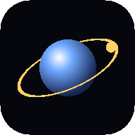
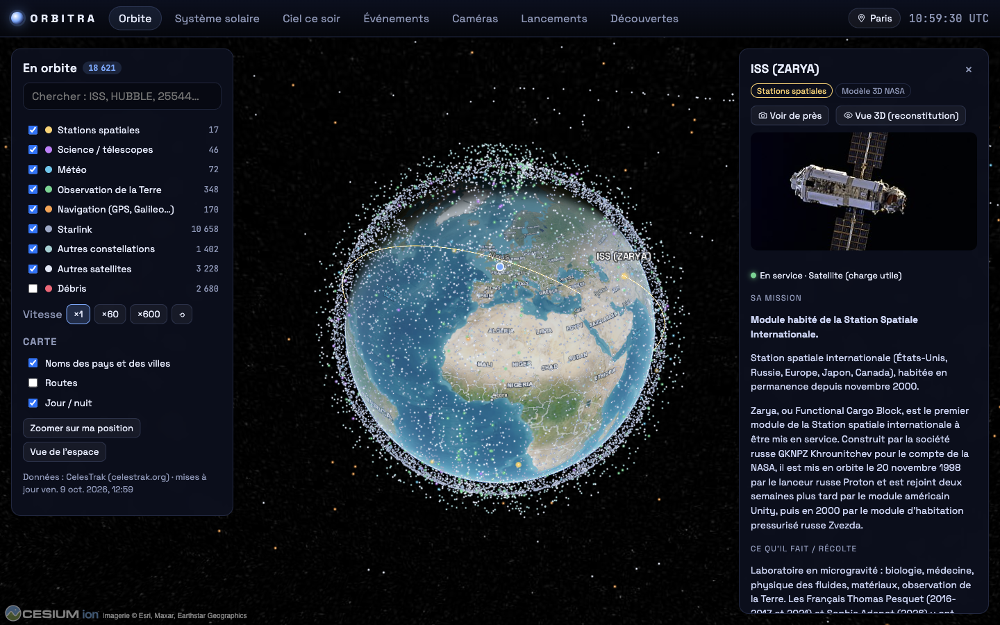
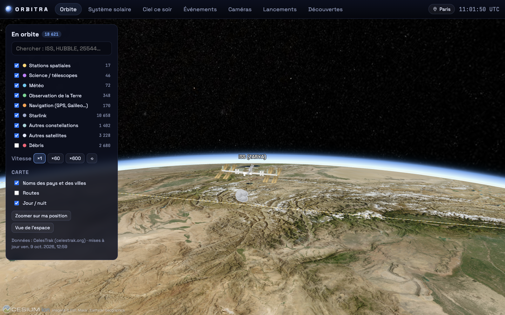
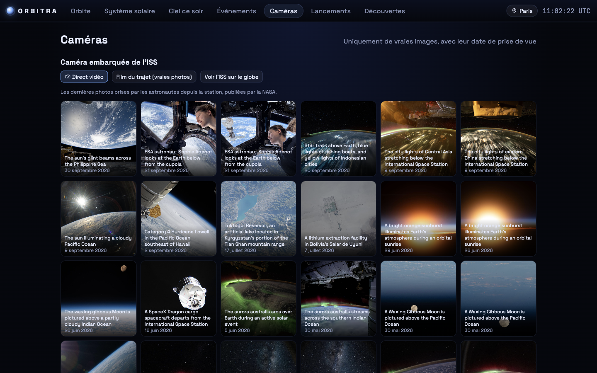
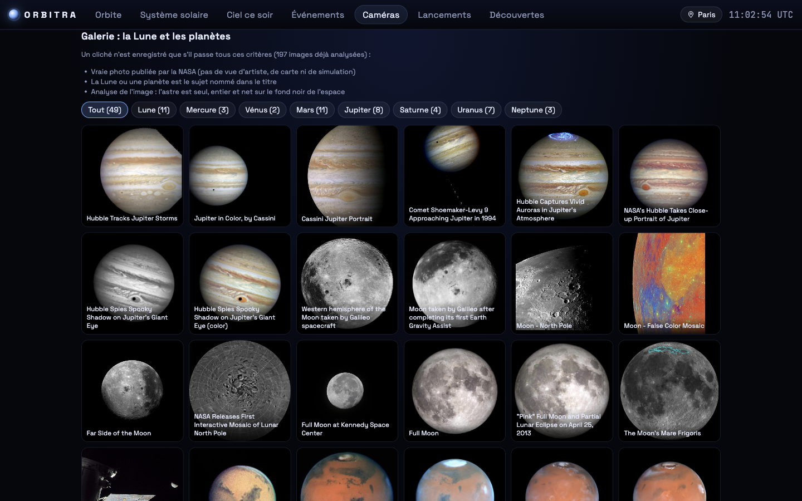

<div align="center">



# Orbitra

Tout ce qui se passe au-dessus de nos têtes, en temps réel.

[](https://github.com/Parzivald1/orbitra/actions/workflows/ci.yml)


**Français** · [English](README.en.md)



</div>

## Pourquoi j'ai fait ça

Un soir je regardais le ciel et j'ai vu un point lumineux le traverser sans clignoter. Je me suis demandé ce
que c'était, à quoi ça servait, qui l'avait envoyé. Et je me suis rendu compte qu'il n'existait pas vraiment
d'appli qui réponde à toutes ces questions au même endroit, en français, et en expliquant comment ça marche.

Alors je l'ai construite. Orbitra suit plus de 18 000 objets en orbite (satellites, débris, stations), calcule
les éclipses, les pluies d'étoiles filantes, la position des comètes, et montre de vraies images prises depuis
l'espace. Mon objectif c'était de **calculer** un maximum de choses moi-même à partir des données brutes de la NASA,
de l'ESA ou du JPL, plutôt que de recopier des listes toutes faites. C'est ce qui m'a le plus appris.

## Ce qu'on peut faire avec

**Le globe.** La Terre en haute définition, on peut zoomer jusqu'aux rues. Les satellites sont recalculés en
continu dans le navigateur. Quand on clique sur un satellite on a sa mission, ce qu'il mesure, depuis quand il
est là, d'où il a décollé, quand sa mission se termine, et ses prochains passages au-dessus de chez soi.
Quand on s'approche de l'ISS, de Hubble ou de Landsat, on voit le vrai satellite en 3D (modèles officiels de la NASA).



**Le dossier OSINT.** Pour chaque satellite j'ai croisé des bases de données ouvertes : qui l'a construit, combien
il pèse, à quel programme il appartient, s'il est civil, commercial ou militaire, s'il est déclaré à l'ONU, et sur
quelles fréquences radio il émet. Pour l'ISS on trouve même les fréquences des scaphandres russes, qu'on peut capter
avec une simple clé SDR.

**Les caméras.** Ici je voulais seulement du vrai : les dernières photos prises par les astronautes de l'ISS,
la Terre entière photographiée toutes les 10 minutes par les satellites météo GOES, le Soleil vu par les sondes
SDO et SOHO. Chaque image affiche sa vraie date. Et il y a une galerie de la Lune et des planètes qui ne garde
que les photos où on voit vraiment bien l'astre (plus de détails plus bas, c'était le plus dur).

<table><tr>
<td></td>
<td></td>
</tr></table>

**Le reste.** Le système solaire en 3D avec 22 comètes et astéroïdes (on peut avancer de 100 ans pour voir Halley
revenir), le ciel du soir depuis sa position, les éclipses avec un compte à rebours, les pluies d'étoiles filantes
notées selon la Lune, les astéroïdes qui frôlent la Terre, les prochains lancements et les dernières exoplanètes découvertes.

## La partie scientifique

C'est la partie dont je suis le plus fier, parce qu'il a fallu comprendre avant de coder.

- **Où sont les satellites.** Chaque satellite est décrit par deux lignes de chiffres (un « TLE »). L'algorithme SGP4
  les transforme en position en tenant compte du frottement de l'atmosphère et du fait que la Terre n'est pas ronde.
- **Quand passe l'ISS au-dessus de moi.** J'ai codé moi-même les changements de repère : du repère inertiel (TEME)
  au repère terrestre (avec le temps sidéral), puis à l'horizon local. Ensuite une dichotomie trouve la seconde exacte
  où l'ISS passe l'horizon. Pour savoir si on la voit à l'œil nu, il faut qu'elle soit éclairée par le Soleil
  alors que l'observateur est dans la nuit, d'où un modèle de l'ombre de la Terre.
- **Les comètes.** Résolution de l'équation de Kepler par la méthode de Newton, sa version hyperbolique pour les
  objets qui viennent d'autres étoiles (ʻOumuamua, Borisov, 3I/ATLAS), et l'équation de Barker pour les paraboles.
- **La taille des astéroïdes.** Estimée à partir de leur magnitude absolue : D = 1329 / √albédo × 10^(−H/5).
- **La galerie.** Un ordinateur ne sait pas si une photo est belle. Par contre il peut mesurer si l'astre est seul,
  entier, net et sur fond noir : bords de l'image, composantes connexes, variance du laplacien pour la netteté.

Tout ça est vérifié par 57 tests automatiques, dont certains comparent mes calculs à de vrais événements :
l'éclipse totale du 12 août 2026 en Espagne, l'éclipse de Lune du 7 septembre 2025, le retour de Halley en 2061.

## Ce qui n'a pas marché

Beaucoup de choses. Quelques exemples : CelesTrak m'a bloqué parce que je téléchargeais trop souvent, il manquait
la comète de Halley parce que mon cache gardait les erreurs en mémoire pendant 24 h, les modèles 3D sortaient tout
noirs puis tout blancs, et ma première galerie a retenu une photo d'arbre parce qu'il s'appelait « Moon Tree ».

J'ai tout noté avec le problème, la cause et le correctif dans le [journal de bord](docs/JOURNAL.md). Honnêtement
c'est le fichier qui montre le mieux comment j'ai travaillé.

## L'installer chez soi

```bash
git clone https://github.com/Parzivald1/orbitra.git
cd orbitra
python3 -m venv .venv && source .venv/bin/activate
pip install -r requirements.txt
uvicorn orbitra.main:app --reload
```

Puis ouvrir http://127.0.0.1:8000 (la doc de l'API est sur `/docs`). Avec Docker :
`docker build -t orbitra . && docker run -p 8000:8000 orbitra`.

Deux options facultatives dans `.env.example` : `CESIUM_ION_TOKEN` pour les bâtiments en 3D, et `EOL_API_KEY`
pour le film du trajet de l'ISS (une clé gratuite à demander à la NASA). Sur téléphone l'appli s'installe
comme une vraie appli depuis le navigateur.

## Comment c'est organisé

```
orbitra/
├── orbitra/          backend Python (FastAPI)
│   ├── astro/        les calculs : Kepler, passages, éclipses, étoiles filantes, ciel, système solaire
│   ├── services/     les données : satellites, OSINT, caméras, galerie, comètes, lancements…
│   └── data/         calendrier des pluies d'étoiles filantes
├── web/              l'interface (HTML/CSS/JS sans framework, CesiumJS et Three.js)
├── tools/            petits scripts (recolorer le modèle 3D de l'ISS)
├── tests/            les tests (aucun n'a besoin d'Internet)
└── docs/             journal de bord et captures
```

## D'où viennent les données

Tout est gratuit et public, et je remercie les gens derrière : [CelesTrak](https://celestrak.org) pour les orbites,
le [GCAT de Jonathan McDowell](https://planet4589.org/space/gcat/) et [SatNOGS](https://db.satnogs.org) pour l'OSINT,
[Wikidata](https://www.wikidata.org) et Wikipédia pour les fiches, le [JPL](https://ssd.jpl.nasa.gov) pour les comètes
et astéroïdes, [The Space Devs](https://thespacedevs.com) pour les lancements, le
[NASA Exoplanet Archive](https://exoplanetarchive.ipac.caltech.edu), la [Spaceflight News API](https://spaceflightnewsapi.net),
l'[IMO](https://www.imo.net) pour les étoiles filantes, Esri pour l'imagerie du globe, les
[modèles 3D de la NASA](https://github.com/nasa/NASA-3D-Resources), NASA GIBS, la NOAA (GOES), la NASA (SDO, EPIC,
photos de l'ISS) et l'ESA (SOHO).

## La suite

- [x] Orbite, système solaire, ciel, événements, lancements, découvertes
- [x] Terre HD, satellites en 3D, caméras réelles, galerie, dossier OSINT
- [ ] Afficher la pollution vue par satellite (NO₂, méthane, CO₂ mesurés par Sentinel-5P) : c'était l'idée de départ
- [ ] Une notification quand l'ISS passe au-dessus de chez soi
- [ ] Les applis Android et iOS
- [ ] L'interface en anglais

## Contribuer

Si tu veux aider, que ce soit pour un bug, une idée ou une faute d'orthographe, tout est dans [CONTRIBUTING.md](CONTRIBUTING.md).

## Comment je l'ai construit

J'ai codé ce projet avec l'aide d'assistants IA (Claude Code, et Antigravity pour relire), un peu comme un binôme.
Moi je décidais ce qu'on faisait, je testais, je trouvais ce qui n'allait pas et je vérifiais les calculs avec de
vrais événements. Les erreurs et la façon dont on les a corrigées sont toutes dans le journal de bord.

## Licence

[MIT](LICENSE) : tu peux réutiliser le code comme tu veux.

<div align="center"><sub>Parzivald1 · Paris · <a href="https://github.com/Parzivald1">@Parzivald1</a></sub></div>
